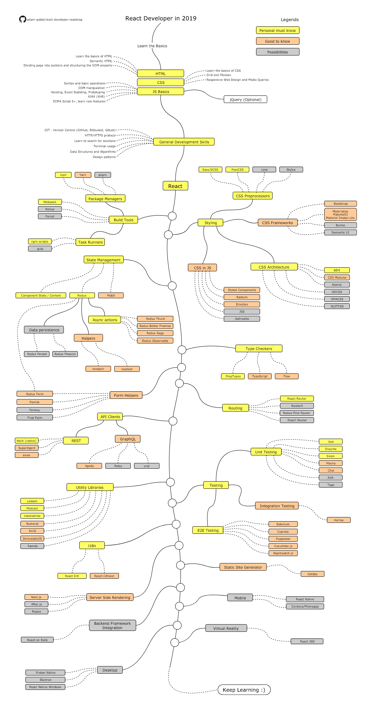

#### Mobile Development
- [Android](./Android.md)
- [React Native](#### Roadmap for React Native)
- [Udacity Android Courses](./UdacityAndroid.md)
- [Curated list of awesome Android libraries and resources](https://github.com/JStumpp/awesome-android) 
- [Curated list of awesome Swift libraries and resources](https://github.com/matteocrippa/awesome-swift) 
- [Curated list of awesome React libraries and resources](https://github.com/jondot/awesome-react-native) 

#### Roadmap for Android development
- Credits: [tientnvn](https://github.com/tientnvn)

# Android Related Resources

## For Beginners

1.  [Udacity Nanodegree Android User Interface](https://www.udacity.com/course/android-basics-user-interface--ud834)
1.  [Udacity Nanodegree Android User Input](https://www.udacity.com/course/android-basics-user-input--ud836)
1.  [Udacity Nanodegree Android Multi-screen Apps](https://www.udacity.com/course/android-basics-multi-screen-apps--ud839)
1.  [Udacity Nanodegree Android Networking](https://www.udacity.com/course/android-basics-networking--ud843)
1.  [Udacity Nanodegree Android Data Storage](https://www.udacity.com/course/android-basics-data-storage--ud845)

## For People with Intermediate Level Expertise

1.  [Udacity Nanodegree Developing Android Apps](https://www.udacity.com/course/new-android-fundamentals--ud851)
1.  [Udacity Nanodegree Advanced Android App Development](https://www.udacity.com/course/advanced-android-app-development--ud855)
1.  [Udacity Nanodegree Gradle for Android and Java](https://www.udacity.com/course/gradle-for-android-and-java--ud867)
1.  [Udacity Nanodegree Material Design for Android Developers](https://www.udacity.com/course/material-design-for-android-developers--ud862)
1.  [Udacity Nanodegree Android Wear Development](https://www.udacity.com/course/android-wear-development--ud875A)
1.  [Google CodeLabs](https://codelabs.developers.google.com/?cat=Android)

#### Roadmap for React Native

# React Native Related Resources

## For Beginners
  1.[React Native Tutorial: Building iOS Apps with JavaScript](https://www.raywenderlich.com/165140/react-native-tutorial-building-ios-android-apps-javascript)

